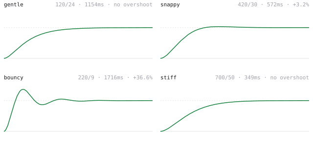
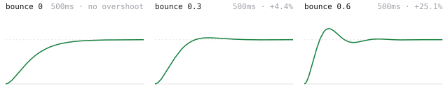
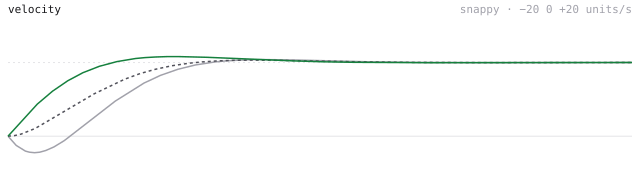
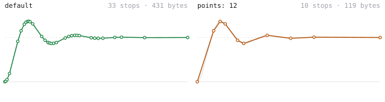

# springline

<p>
  <a href="https://www.npmjs.com/package/springline"></a>
  
  
  
</p>

Spring easing as a CSS `linear()` string. Tune stiffness, damping and mass, or just say how long it should take and how much it should bounce. Paste the result into any transition. Nothing ships to the browser.



## Install

```sh
npm i springline
```

## Use

```js
import { spring, presets } from "springline";

const { easing, duration } = spring({ stiffness: 300, damping: 22 });
el.style.transition = `transform ${duration}s ${easing}`;
```

Or pick a preset and go:

```js
spring(presets.snappy);
// { easing: "linear(0, 0.0045 1.2%, …, 1)", duration: 0.572, overshoot: 0.032, … }
```

Everything is a plain function call at build time or in a design tool. The output is a string. The animation runs on the compositor like any other CSS transition.

## Two ways to describe a spring

**Physics.** `stiffness`, `damping`, `mass`. Duration comes out.

```js
spring({ stiffness: 180, damping: 17, mass: 1 });
```

**Duration.** `duration` in seconds and `bounce` from 0 to 1. This is Apple's model: say how long it takes and how much it overshoots, and the physics are solved for you.

```js
spring({ duration: 0.4, bounce: 0.2 });
```



## Velocity

Pass the velocity a gesture ended with and the curve continues it. Units are the target distance per second, so `velocity: 2` means "moving at twice the total distance every second". Positive is towards the target, negative is away.

```js
spring({ ...presets.snappy, velocity: -20 });
```



## Point budget

`linear()` strings can get long. springline keeps the stops where the curve bends and drops them where it is flat, using percentage positions so no bytes are wasted on straight runs. Cap it with `points` when every byte matters.

```js
spring({ ...presets.bouncy, points: 12 });
```



## Presets

| Preset | stiffness | damping | Settles | Overshoot |
| --- | --- | --- | --- | --- |
| `presets.gentle` | 120 | 24 | 1154ms | none |
| `presets.snappy` | 420 | 30 | 572ms | 3.2% |
| `presets.bouncy` | 220 | 9 | 1716ms | 36.6% |
| `presets.stiff` | 700 | 50 | 349ms | none |

Presets are plain option objects. Spread and override: `spring({ ...presets.bouncy, mass: 2 })`.

## Result

```ts
interface SpringResult {
  easing: string;    // linear(…) for transition-timing-function
  duration: number;  // seconds
  fallback: string;  // closest cubic-bezier for browsers without linear()
  overshoot: number; // 0.12 = travels 12% past the target
  stops: { at: number; value: number }[];
}
```

`linear()` is supported in every current browser. For anything older, `fallback` is the nearest `cubic-bezier` picked by least squares:

```js
const s = spring(presets.bouncy);
el.style.transitionTimingFunction = CSS.supports("animation-timing-function", "linear(0, 1)")
  ? s.easing
  : s.fallback;
```

## What it can't do

A CSS transition retargets from its current position when interrupted, but the easing restarts. A drag you release mid-flight still wants a runtime spring. For everything that starts from rest, which is most UI, this is all you need.

## License

MIT
